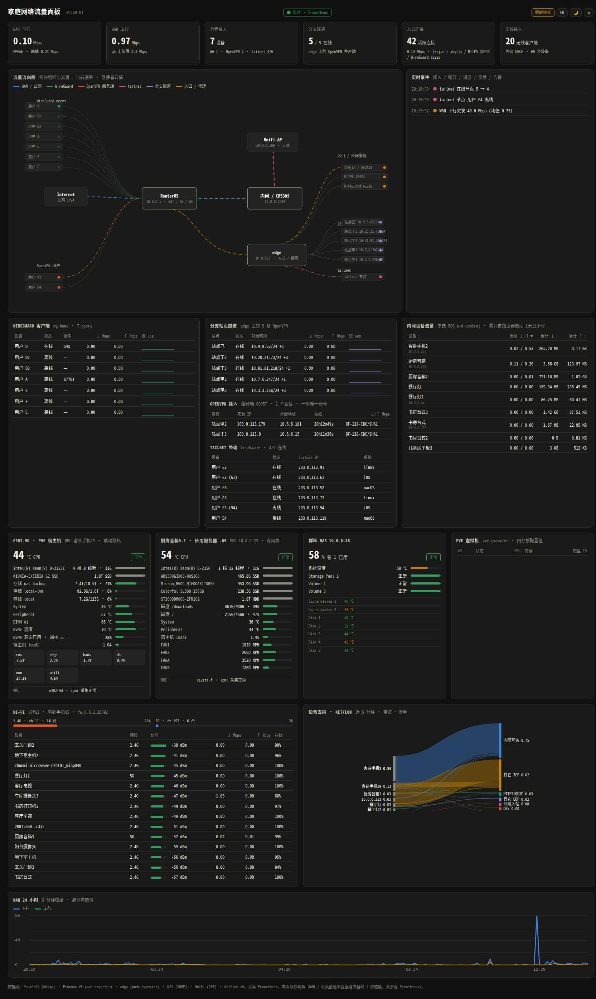
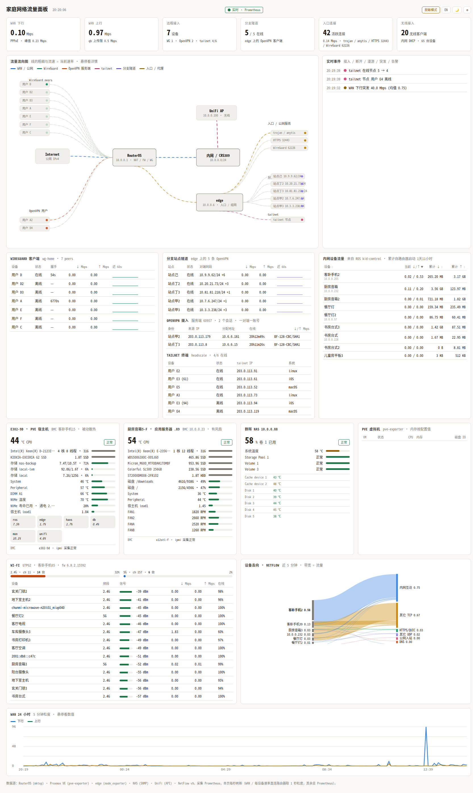
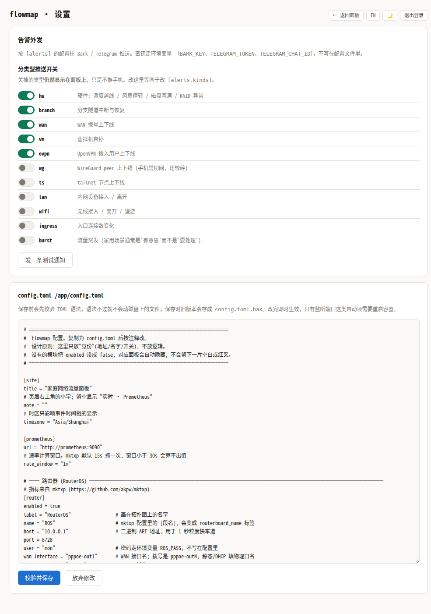

<div align="center">

# lanpulse

**MikroTik RouterOS 的实时流量面板**

一张图看清：谁在用带宽、流量从哪进来往哪去、隧道通不通、机器热不热。

`RouterOS` · `Prometheus` · `零构建` · `中/英` · `亮/暗`

[**在线演示**](https://mrtian2016.github.io/routeros-lanpulse/) · [English](README.md) · [**路由器侧配置**](docs/SETUP.zh-CN.md) · [配置说明](docs/CONFIG.md)

</div>



<details>
<summary>亮色主题</summary>


</details>

> 截图里的设备名、IP、站点名都是**脱敏模式**生成的假名 —— 这是内置功能，见 [脱敏](#脱敏)。

---

## 先说清楚：这是一个 RouterOS 面板

**MikroTik 路由器不是众多数据源之一，它是地基。** 十五个面板里有八个来自它，
而且正是让这一页值得看的那八个：

| 必须有 RouterOS | 可选附加 |
|---|---|
| WAN 上下行 + 24 小时曲线 | Proxmox VE 虚拟机 / 存储池 |
| 流向图本身 | 机箱温度与风扇（IPMI） |
| 内网每设备流量（靠 `kid-control`） | NAS 容量与硬盘健康（SNMP） |
| WireGuard peers | 无线客户端信号与速率（UniFi） |
| OpenVPN 拨入用户 | 设备去向桑基图（NetFlow） |
| 设备名（来自 DHCP 租约） | 隧道 / 入口流量统计（textfile） |
| 一半的实时事件（路由器日志） | |
| 公网 IP | |

有两处特别不好移植：内网每设备流量依赖 RouterOS 的 **`kid-control`**，
OPNsense / OpenWrt 上没有对等功能；1 秒粒度来自与 RouterOS **二进制 API** 的长连接。

**不用 MikroTik 的话，这个项目打开就是一张空页面。** 这不是缺陷，它就建在这上面。

## 它解决什么问题

Grafana 很强，但要盯"现在家里网络是什么状态"，你得在十几个 panel 之间来回看。
lanpulse 把这些收进一页：一张会流动的拓扑图 + 一条实时事件流 + 几张关键表。

- **1 秒粒度**：WAN / 每设备 / 隧道速率直连路由器算差值，不受 Prometheus 抓取间隔限制
- **事件流而不是曲线**：设备上下线、隧道中断、流量突发、磁盘写满、风扇停转 —— 变化才是你要看的
- **只显示你有的东西**：没装 IPMI 就不显示硬件面板，没有 UniFi 就没有无线区，配置里关掉即可
- **零构建**：前端是原生 ES 模块，后端只用 Python 标准库，`docker compose up` 就跑起来

## 快速开始

**先做[路由器侧配置](docs/SETUP.zh-CN.md)** —— 只读账号、API 服务、`kid-control` profile。
五分钟的事，跳过它是面板打开一片空白的头号原因。

```bash
git clone https://github.com/mrtian2016/routeros-lanpulse.git && cd routeros-lanpulse
cp config.example.toml config.toml     # 改成你自己的地址和名字
cp .env.example .env                   # 填密码
docker compose --profile router up -d  # 只跑面板 + Prometheus + RouterOS 采集
```

> 以后更新：`git pull && docker compose pull && docker compose up -d`。
> 自己改过代码就加 `--build` —— `up -d` 在镜像 tag 已存在时**不会**重新构建。

打开 `http://<你的主机>:9132`。

`--profile` 决定跑哪些采集器，只跑你真有的：

| profile | 采集什么 |
|---|---|
| *(不加)* | 只有面板 + Prometheus |
| `router` | RouterOS（mktxp） |
| `pve` | Proxmox VE |
| `ipmi` | 带 BMC 的机器温度 / 风扇 |
| `snmp` | 群晖 NAS、交换机 |
| `netflow` | 设备去向桑基图 |
| `unifi` | UniFi 无线客户端信号 / 速率 |
| `all` | 全部 |

## 先看看效果

**[在线演示](https://mrtian2016.github.io/routeros-lanpulse/)** —— `docs/demo/` 是一份**脱敏快照**做的静态演示站，纯 HTML，
扔到 GitHub Pages 或任意静态托管就能跑，不需要后端也不需要 Prometheus。

```bash
python3 -m http.server -d docs/demo 8000   # 本地预览
```

演示数据由 `scripts/make-demo.py` 从一个开着脱敏的实例生成 ——
生成器会检查快照上的 `redacted` 标记，**没开脱敏会直接拒绝**，不会拿真实数据做演示站。

## 设置页

面板本身在内网直接看，不需要登录；**改配置需要登录**。

在 `.env` 里设 `ADMIN_PASSWORD` 后，右上角 ⚙ 进设置页，可以直接编辑 `config.toml`：
保存前校验 TOML 语法，语法不过不动磁盘上的文件；保存时旧版本存成 `config.toml.bak`；
改完即时生效，只有监听端口这类启动项需要重启容器。

**不设 `ADMIN_PASSWORD` 的话设置页整个关闭** —— 这是刻意的：
自托管项目最常见的翻车方式就是留一个默认密码然后被扫到，所以这里没有默认密码可留。

会话是 HttpOnly + SameSite=Strict 的 cookie，8 小时过期；同一 IP 连续 5 次密码错误锁 5 分钟。

## 需要什么

**必需**：一台跑 RouterOS 的 MikroTik 路由器、用来采集它的
[mktxp](https://github.com/akpw/mktxp)、以及 Prometheus（compose 里自带）。
开发是基于 RouterOS 7.x 的；6.x 大部分指标应该也有，但没测过。

**可选**（缺哪个就关哪个，面板会自动隐藏对应区块）：

| 模块 | 来源 |
|---|---|
| 虚拟机 / 存储池 | `prometheus-pve-exporter` |
| 机箱温度 / 风扇 | `ipmi-exporter` |
| NAS 容量 / 硬盘温度 | `snmp-exporter` |
| 无线客户端信号 | 本项目自带的 `unifi-exporter`（用 API Key，不需要本地账号） |
| 设备去向 | 本项目自带的 NetFlow v9 收集器 |
| 隧道 / 入口流量 | 边缘主机上放 `exporters/textfile/` 里的脚本 |

## 配置

全部配置在一个 `config.toml` 里，**只放身份（地址、名字、开关），不放密码** ——
密码走 `.env`，这样配置文件可以直接贴到 issue 里问问题。

```toml
[router]
host = "192.168.1.1"              # 路由器地址
wan_interface = "pppoe-out1"   # 拨号是 pppoe-outN, 静态/DHCP 填物理口名
lan_interface = "bridge"

[[hardware]]                   # 有几台带 BMC 的机器就写几段, 没有就全删
title = "主力机"
bmc = "host-a"
instance = "192.168.1.10:9100"
storage = "pve"                # pve = 显示存储池 | fs = 显示文件系统 | none

[topology.nodes]               # 拓扑图的形状; 删掉节点, 连它的线也会消失
internet = { x = 80,  y = 250, w = 110, h = 48, name = "Internet", sub = "公网 IPv4" }
ros      = { x = 330, y = 250, w = 140, h = 56, name = "RouterOS", core = true }
```

完整选项见 [`config.example.toml`](config.example.toml)，每一项都有注释。

## 脱敏

要把截图发到网上，或者想让别人看看效果又不想暴露自己的网络：

```toml
[redact]
enabled = true
```

打开后 `/api/state.json` 里的公网 IP、内网 IP、MAC、域名、设备名、站点名会被替换成
**确定性假名** —— 同一台设备每次都映射到同一个假名，所以图上的关系不会乱，但从假名反推不出真值。
公网 IP 统一落到 `203.0.113.0/24`（RFC 5737 文档专用网段）。

仓库里的 `scripts/leakscan.py` 可以自查：拿脱敏后的输出去搜真实标识，搜到就是漏了。

## 告警外发

事件可以推到 **Bark**（iOS）和 **Telegram**：

```toml
[alerts]
enabled = true
lang = "zh"                  # 通知文案语言, 和界面语言各自独立
levels = ["warn", "bad"]     # info 一般是噪音, 默认不发
cooldown_sec = 300           # 同一条文案多久内不重复
startup_quiet_sec = 60       # 启动静默
max_per_hour = 20            # 每小时上限
min_burst_mbps = 200         # 突发类事件单独的推送门槛, 0 = 不额外过滤

[alerts.bark]
enabled = true
server = "https://api.day.app"    # 自建就填自己的

[alerts.telegram]
enabled = true
api_base = "https://api.telegram.org"
```

密钥走 `.env`：`BARK_KEY`、`TELEGRAM_TOKEN`、`TELEGRAM_CHAT_ID`。
设置页有「发一条测试通知」按钮，会分渠道报告结果。

### 分事件类型的开关

11 类事件各有独立开关，**关掉的类型仍然显示在面板上，只是不推手机**：

```toml
[alerts.kinds]
hw = true          # 硬件: 温度越线 / 风扇停转 / 磁盘写满 / RAID 异常
branch = true      # 分支隧道中断与恢复
wan = true         # WAN 拨号上下线
vm = true          # 虚拟机启停
ovpn = true        # OpenVPN 拨入用户上下线
wg = false         # WireGuard peer 上下线 (手机常切网, 比较碎)
ts = false         # tailnet 节点上下线
lan = false        # 内网设备接入 / 离开
wifi = false       # 无线接入 / 离开 / 漫游
ingress = false    # 入口连接数变化
burst = false      # 流量突发
```

默认值按「是否需要你动手」定：要处理的默认开，信息性的默认关。
设置页有对应的开关，改哪边都一样 —— 后台改配置时**注释会原样保留**
（标准库没有 TOML 写入器，整段重新序列化会把注释全丢掉，所以这里是按行改的）。



> 配置里没列到的类型默认**推送**。升级带来新事件类型时，宁可吵一下，也别静默吞掉。

**面板阈值和推送阈值是两回事**，这点值得单独说：

`[events]` 里的 `wan_burst_floor_mbps` 等门槛调低是为了**看趋势**——8 Mbps 就在面板上标出来，
一眼能看出谁在动。但一次正常下载没必要响手机。所以推送侧另有两个开关：

- `[alerts] min_burst_mbps` —— 只有超过这个量的突发才推送（面板照常显示）
- `[events] burst_level = "info"` —— 把突发降级成 info，面板照常显示但永不推送

同理 `threshold_level` 管温度/磁盘越线事件的级别。事件本身携带数值（`v` 字段），
推送侧就是靠它做大小过滤的。

几个刻意的设计：

- **启动静默期**：刚起来时会把路由器日志缓冲区里的历史条目重放一遍，不静默的话每次重启都炸一屏通知。
- **去重 + 每小时上限**：隧道反复上下线这类抖动最容易刷爆手机。宁可漏，不可吵 —— 太吵的告警等于没有告警。
- **后台线程发送**：推送走公网，慢或超时都不能拖住每秒一次的事件引擎。一个渠道挂了不影响另一个，失败只打日志。
- **Telegram 官方 API 在部分地区不可达**：可以把 `api_base` 指到自建反代，或者给容器设 `https_proxy` 环境变量（urllib 默认就认）。

## 架构

```
浏览器 ──1s──> lanpulse-agent ──┬──> Prometheus ──> 各 exporter
                               └──> RouterOS API (8728, 长连接)
```

- **agent**（Python 标准库，无依赖）：从 Prometheus 聚合出一份 `state.json`；
  同时用 RouterOS 二进制 API 长连接每秒读一次计数器，补上 Prometheus 给不了的 1 秒粒度。
  *（用二进制 API 而不是 REST：REST 每个请求都会在路由器日志里写一条登录/登出，1 秒轮询几分钟就能刷爆日志缓冲区。）*
- **前端**（原生 ES 模块，无构建）：`index.html` 只是骨架，配置由后端注入到页面里，
  所以初始化不需要等任何 fetch。

## 贡献

翻译特别欢迎 —— `lanpulse/web/js/i18n.js` 就是一张中英对照表，
**用中文原文当 key**，漏掉的条目自动回退显示中文，不会出现 `panel.lan.title` 这种占位符。

## License

MIT

## 路线图

- [x] 告警外发（Bark / Telegram）
- [ ] 更多告警渠道（ntfy / 企业微信 / Webhook）
- [ ] 其它路由器平台 —— 老实说工作量不小：`kid-control` 在别处没有对等物，
      每设备流量得换一套完全不同的机制（conntrack 计费或每主机队列）

- [x] 配置化（地址 / 名字 / 拓扑 / 阈值全部进 `config.toml`）
- [x] 模块开关与自动隐藏
- [x] 脱敏模式 + 泄漏自查脚本
- [x] 暗色 / 亮色主题
- [x] 中英双语（界面）
- [x] 中英双语（含事件文案）
- [x] 网页设置页（带登录鉴权；未配置管理员密码时整页关闭）
- [x] 演示模式（不装任何东西就能预览的静态数据）
